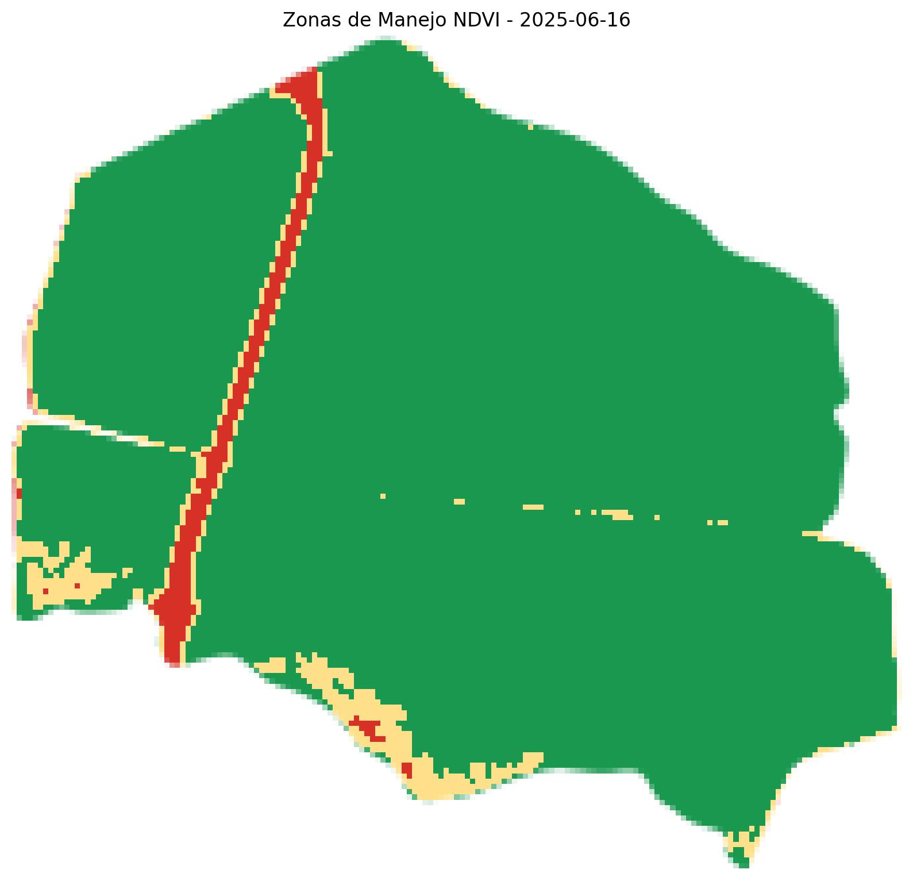
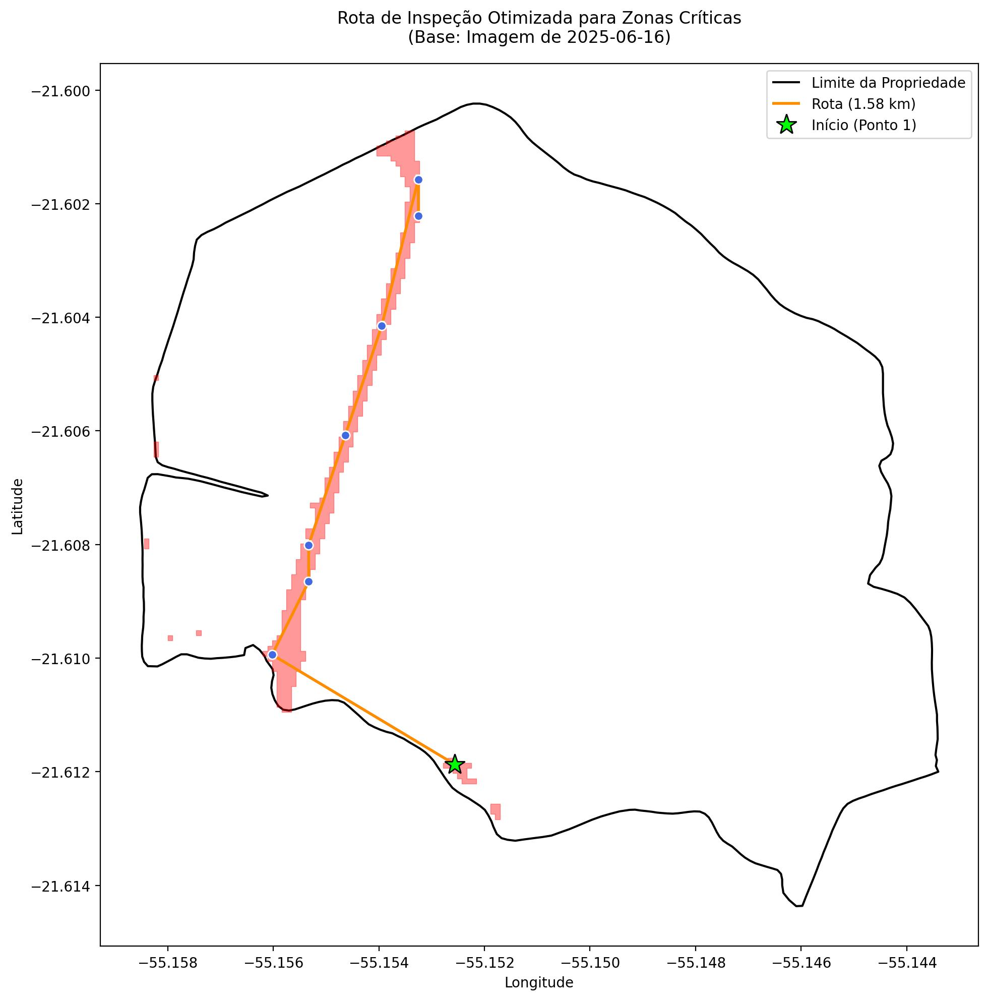

<p align="center">
  
</p>

# Geração de Vetores de Inspeção Agrícola Baseada em Zonas de Manejo

## 1. Introdução

Este repositório documenta o desenvolvimento e a implementação de uma metodologia computacional para a criação de vetores de inspeção agrícola otimizados. O sistema foi projetado para traduzir dados de sensoriamento remoto em rotas de campo acionáveis, direcionando a atenção de agrônomos e consultores para áreas que demandam investigação prioritária. A principal inovação reside na integração de uma análise de classificação de imagens de satélite para identificar "zonas críticas" — áreas com anomalias no desenvolvimento vegetativo — e, subsequentemente, aplicar algoritmos de otimização para gerar o percurso mais eficiente para a verificação in-loco destes locais.

O projeto evoluiu a partir de protótipos iniciais até uma solução final robusta, que automatiza o fluxo de trabalho desde a aquisição de dados até a exportação de arquivos geoespaciais compatíveis com sistemas de informação geográfica (SIG) e dispositivos de navegação.

## 2. Materiais e Métodos

A metodologia foi estruturada em um fluxo de trabalho sequencial, utilizando um conjunto de bibliotecas Python de código aberto e serviços de dados geoespaciais. O código-fonte está organizado em protótipos que demonstram a evolução da abordagem.

### 2.1. Aquisição e Processamento de Dados

* **Dados Vetoriais**: As geometrias dos talhões agrícolas (polígonos) são obtidas de um banco de dados PostgreSQL com a extensão PostGIS. A conexão é estabelecida através da biblioteca `SQLAlchemy` e a manipulação dos dados é realizada com `GeoPandas`.

* **Dados de Satélite**: Imagens multiespectrais do satélite Sentinel-2 (nível de processamento SR - Reflectância de Superfície) foram utilizadas como principal fonte de dados para a análise da vegetação. A busca, filtragem por data e área de interesse, e o processamento inicial (como mascaramento de nuvens) são realizados através da API da plataforma Google Earth Engine (GEE).

### 2.2. Protótipos e Evolução da Metodologia

A solução final foi alcançada por meio de um processo iterativo, documentado pelos scripts presentes neste repositório.

<table align="center">
    <thead>
        <tr>
            <th align="center">Protótipo</th>
            <th align="center">Descrição da Abordagem</th>
            <th align="center">Visualização do Resultado</th>
        </tr>
    </thead>
    <tbody>
        <tr>
            <td><code>vetor_inspecao.py</code> e <code>vector_v2.py</code></td>
            <td>
                Estes scripts representam as abordagens iniciais. A primeira versão (<code>vetor_inspecao.py</code>) gera pontos de amostragem ao longo de linhas-guia paralelas ao eixo principal do polígono. A segunda (<code>vector_v2.py</code>) distribui pontos em uma grade uniforme que cobre toda a extensão do talhão. Ambas as abordagens, embora sistemáticas, não direcionam a amostragem para áreas de interesse específico, tratando toda a área de forma homogênea.
            </td>
            <td align="center">
                
                <br>
                <sub>Figura 1: Rota de inspeção gerada sobre a área total do talhão.</sub>
            </td>
        </tr>
        <tr>
            <td><code>vector_class.py</code></td>
            <td>
                Este script implementa o módulo de análise de imagem. Ele calcula o Índice de Vegetação por Diferença Normalizada (NDVI) a partir das bandas do infravermelho próximo (B8) e do vermelho (B4) do Sentinel-2. Subsequentemente, aplica um algoritmo de classificação não supervisionada (Jenks Natural Breaks) para segmentar a imagem NDVI em três classes (baixa, média e alta vitalidade vegetativa), identificando as zonas de manejo. O resultado é um arquivo GeoJSON contendo apenas os polígonos da classe de interesse (zonas críticas).
            </td>
            <td align="center">
                
                <br>
                <sub>Figura 2: Classificação do talhão em zonas de manejo com base no NDVI.</sub>
            </td>
        </tr>
    </tbody>
</table>

### 2.3. Metodologia Final Integrada (`vector_class_insp.py`)

O script `vector_class_insp.py` representa a consolidação das etapas anteriores em uma única solução. O fluxo de trabalho é o seguinte:

1.  **Identificação de Zonas Críticas**: O processo inicia com a execução da análise de NDVI e classificação, conforme descrito no protótipo `vector_class.py`, para gerar os polígonos das zonas críticas.

2.  **Geração de Pontos de Amostragem**: Diferentemente dos protótipos iniciais, os pontos de amostragem são gerados exclusivamente dentro dos limites dos polígonos das zonas críticas. A quantidade de pontos é determinada dinamicamente com base na área total dessas zonas. A distribuição espacial dos pontos segue um padrão de grade uniforme para garantir uma cobertura sistemática das áreas de interesse.

3.  **Otimização de Rota (Problema do Caixeiro-Viajante - TSP)**: Com os pontos de inspeção definidos, o sistema modela o desafio como uma instância do Problema do Caixeiro-Viajante (TSP). Utilizando a biblioteca `OR-Tools` do Google, um solver de otimização calcula a rota mais curta que conecta todos os pontos, partindo de um nó inicial que pode ser definido interativamente pelo usuário.

4.  **Exportação de Resultados**: O sistema exporta a rota otimizada e os pontos de inspeção numerados como arquivos GeoJSON, um formato padrão para dados geoespaciais.

## 3. Resultados

A execução do script final (`vector_class_insp.py`) para um talhão de exemplo (ID 48) produz um conjunto de arquivos que servem como um plano de ação completo para a inspeção de campo.

<table align="center">
    <thead>
        <tr>
            <th align="center">Artefato de Saída</th>
            <th align-="center">Descrição</th>
        </tr>
    </thead>
    <tbody>
        <tr>
            <td><code>zonas_criticas.geojson</code></td>
            <td>Arquivo vetorial contendo os polígonos das áreas classificadas como críticas.</td>
        </tr>
        <tr>
            <td><code>pontos_inspecao_criticos.geojson</code></td>
            <td>Arquivo vetorial com os pontos de amostragem, distribuídos dentro das zonas críticas, contendo um atributo "pt_id" para ordenação.</td>
        </tr>
        <tr>
            <td><code>rota_inspecao_critica.geojson</code></td>
            <td>Arquivo vetorial (LineString) representando o percurso otimizado que conecta todos os pontos de inspeção.</td>
        </tr>
    </tbody>
</table>

A visualização consolidada destes resultados é apresentada na figura abaixo, que sobrepõe o limite do talhão, as zonas críticas identificadas, os pontos de inspeção numerados e a rota otimizada.

<p align="center">
  
  <br>
  <sub>Figura 3: Mapa final consolidado, exibindo a rota de inspeção otimizada sobre as zonas críticas do talhão.</sub>
</p>

## 4. Requisitos e Instalação

Para executar os scripts, é necessário ter o Python instalado e as seguintes bibliotecas. A instalação pode ser realizada via `pip`.

```bash
pip install geopandas shapely sqlalchemy psycopg2-binary numpy matplotlib ortools customtkinter tkcalendar earthengine-api Pillow requests
````

Adicionalmente, é requerida a autenticação no Google Earth Engine. Execute o seguinte comando em um terminal e siga as instruções para autenticar sua conta:

```bash
earthengine authenticate
```

## 5\. Estrutura do Projeto

```
.
├── output/
│   └── id_48/
│       ├── mapa_inspecao_final.jpeg
│       ├── mapa_zonas_ndvi.jpeg
│       ├── pontos_inspecao_criticos.geojson
│       ├── rota_inspecao_critica.geojson
│       └── zonas_criticas.geojson
│
├── vetor_inspecao.py           # Protótipo 1: Pontos em linhas-guia
├── vector_v2.py                # Protótipo 2: Pontos em grade uniforme
├── vector_class.py             # Protótipo 3: Módulo de classificação de zonas
├── vector_class_insp.py        # Solução Final: Script integrado
└── README.md
```

## 6\. Conclusão

A metodologia desenvolvida representa um avanço significativo na otimização de operações de campo na agricultura de precisão. Ao focar os esforços de inspeção em áreas com evidências de estresse ou anomalias, o sistema não apenas economiza tempo e recursos, mas também aumenta a probabilidade de detecção precoce de problemas fitossanitários, nutricionais ou de manejo hídrico. A natureza modular e a utilização de ferramentas de código aberto garantem a flexibilidade e a escalabilidade da solução para diferentes contextos agrícolas.